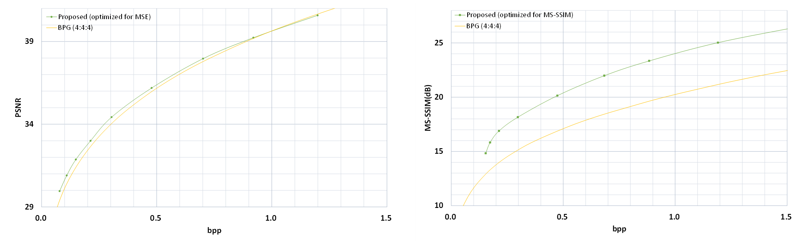
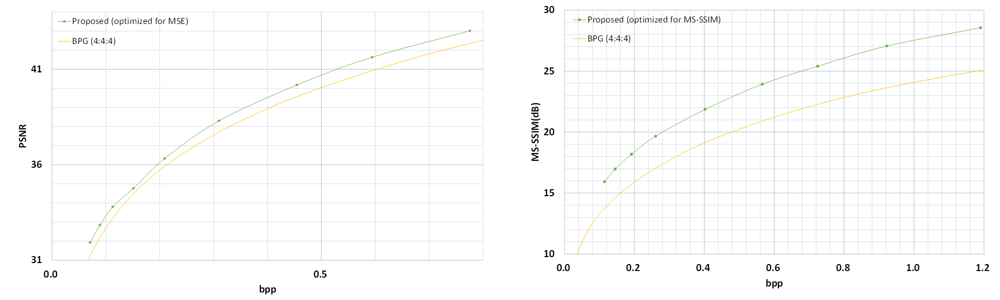
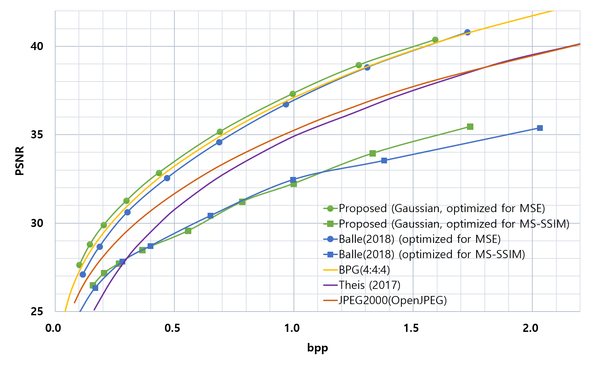
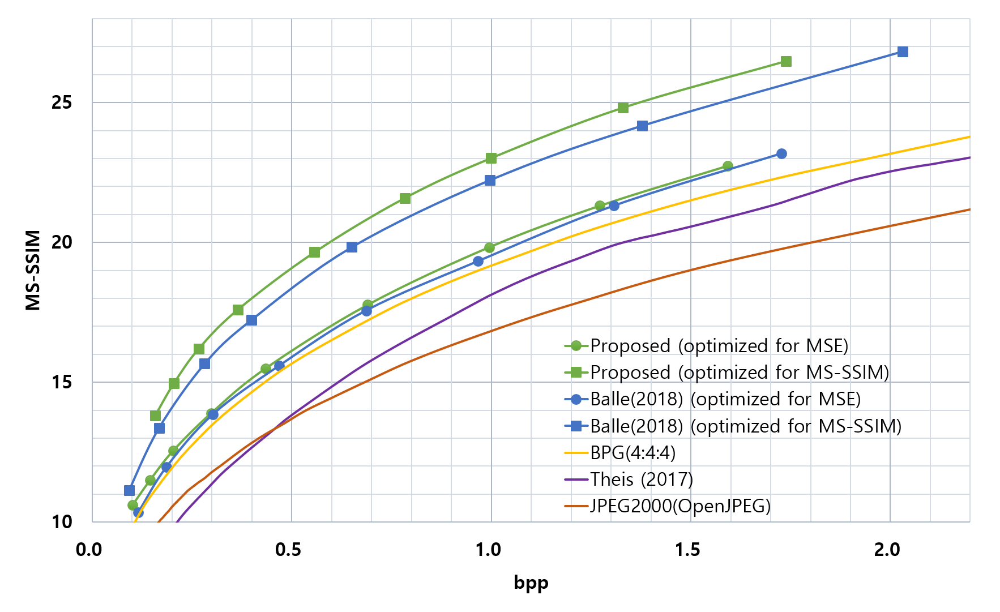

#  Context-adaptive Entropy Model for End-to-end Optimized Image Compression
Repository of the paper ["Context-adaptive Entropy Model for End-to-end Optimized Image Compression"](http://arxiv.org/abs/1809.10452)

## Introduction
This repository includes [evaluation results](https://github.com/JooyoungLeeETRI/CA_Entropy_Model/tree/master/Evaluation%20Results), [reconstructed images](https://github.com/JooyoungLeeETRI/CA_Entropy_Model/tree/master/Reconstructed%20images), and [test codes](./CA_EntropyModel_Test) of our paper ["Context-adaptive Entropy Model for End-to-end Optimized Image Compression"](http://arxiv.org/abs/1809.10452). Please refer to [the paper](http://arxiv.org/abs/1809.10452) for the detailed information. If  [the paper](http://arxiv.org/abs/1809.10452) or this repository helps you, please cite our work as:
~~~
@InProceedings{Lee2019Context,
    author = {Lee, Jooyoung and Cho, Seunghyun and Beack, Seung-Kwon},
    title = {Context-adaptive Entropy Model for End-to-end Optimized Image Compression},
    booktitle = {the 7th Int. Conf. on Learning Representations},
    month = {May},
    year = {2019}
}
~~~

>**[Updated on Mar 31, 2020]**
>We've uploaded [**the second version of our test codes**](./CA_EntropyModel_Test_v2). The second version uses **THE SAME MODELS** as for the first version. If you've already downloaded our models before, just copy them into the "models" directory under the working directory. 
>The followings are the new features of the updated test codes.
>
>* Now you can compress images of various sizes much more efficiently. By following the new padding method described in the supplemental material of [An End-to-End Joint Learning Scheme of Image Compression and Quality Enhancement with Improved Entropy Minimization](https://arxiv.org/abs/1912.12817), our second test codes minimize the unnecessary padding area. Now only up to 1 (vertical/horizontal) line is added to the input image. With the updated test codes, our model obtained apparently better reseults than that of BPG over various imagesets such as the SAMPLING test of Tecnick and the validation set of CLIC, as shown in the figures below:
>
>|  |
>|:--:|
>| *Test results over the CLIC validation set* |
>
>||
>|:--:|
>| *Test results over the Tecnick SAMPLING imageset* |
>
>* We've fixed a few bugs due to the integer division that operates differently depending on the operating system.
>* A list of files indicated by the wildcard character can be used as an input argument. However, some environments expand the asterisk to every matching file before passing the arguments. To deal with this issue, you can modify the source files([encode.py](./CA_EntropyModel_Test_v2/encode.py) and [decode.py](./CA_EntropyModel_Test_v2/decode.py)) for your own system.
>* [**The new test codes**](./CA_EntropyModel_Test_v2) support parallel encoding/decoding of multiple files at the same time.
>* For more detailed instructions, please refer to [the second version of our test codes](./CA_EntropyModel_Test_v2)

## Reconstructed samples

## Evaluation results
We optimized the networks with the two different types of distortion terms, one with MSE and the other with MS-SSIM. For each distortion type, the average bits per pixel (BPP) and the distortion, PSNR or MS-SSIM, over 24 PNG images of the [Kodak PhotoCD image dataset](http://r0k.us/graphics/kodak/) are measured for each of the nine R-D configurations. Therefore, a total of 18 networks are trained and evaluated. To our best knowledge, this is the first test results of ANN-based image compression which outperform [BPG](https://bellard.org/bpg/), in terms of PSNR as well as MS-SSIM.

Followings are the rate-distortion curves of the proposed method and competitive methods. The top plot represents PSNR values in consequence of bpp changes, while the bottom plot shows MS-SSIM values in the same manner. Note that MS-SSIM values are converted to decibels for differentiating the quality levels. 

The compression gains in terms of BD-rate of PSNR over [JPEG2000](http://www.openjpeg.org/), [Balle'18(MSE-optimized)](https://arxiv.org/abs/1802.01436), [BPG](https://bellard.org/bpg/) are 34.08\%, 11.87\%, 6.85\%, respectively. In case of MS-SSIM, we found the wider gaps of 68.82\%, 13.93\%, 49.68\%, respectively.

## Test code [DEPRECATED]
>**[Updated on Mar 31, 2020]**
>Please use [**the second version of our test codes**](./CA_EntropyModel_Test_v2) for more efficient and exact evaluation. Its instructions are provided via [readme.text](./CA_EntropyModel_Test_v2/readme.txt) in [the second version of our test codes](./CA_EntropyModel_Test_v2). The following instructions for the previous version of our test code will be deleted from our repositary sooner or later.

We provide [test codes](./CA_EntropyModel_Test) for evaluating a image compression model proposed in our work ["Context-adaptive Entropy Model for End-to-end Optimized Image Compression"](http://arxiv.org/abs/1809.10452). The model includes two types of models, base models for low bpp and hybrid models for high bpp.

### Supported I/O formats
Python Imaging Library (PIL) is used in our test code. To file the supported formats, please refer to https://pillow.readthedocs.io/en/4.1.x/handbook/image-file-formats.html. PNG and BMP formats including RGB channels have been tested.

### Encoding
* usage: 
encode.py [-h] [--model_type {0,1}] [--input_path INPUT_PATH]
                 [--compressed_file_path COMPRESSED_FILE_PATH]
                 [--quality_level {1,2,3,4,5,6,7,8,9}]

* optional arguments:
  --model_type {0,1}    	0: MSE optimized 1: MS-SSIM optimized
  --input_path 			input image path
  --compressed_file_path 	target compressed file path
  --quality_level {1,2,3,4,5,6,7,8,9}	quality level from 1 to 9. The higher, the better

* Sample command for encoding:
python encode.py --model_type 0 --input_path ./examples/input_example.png --compressed_file_path ./examples/output.cmp --quality_level 5

### Decoding
* usage: 
decode.py [-h] [--compressed_file_path COMPRESSED_FILE_PATH]
                 [--recon_path RECON_PATH]

* optional arguments:
  --compressed_file_path 	input compressed file path
  --recon_path 			target reconstructed image path

* Sample command for decoding:
python decode.py --compressed_file_path ./examples/output.cmp --recon_path ./examples/recon_example.png

## Notes
* When you excute test codes for the first time, it may take a few minutes to download models. Please be patient.
* When HDF5 version error occurs during tests, please try to install HDF5 1.10.1. When you use anaconda environment, you can install it using the following command:
conda install -c anaconda hdf5=1.10.1
* Currently test codes spend most of time for arithmetic coding and decoding. We implemented the arithmetic coder that operates with the model parameter such as mu and sigma, based on [Nayuki's work](https://github.com/nayuki/Reference-arithmetic-coding). We really appreciate for her great effort. Note that, however, current the model-based arithmetic coder is not fully optimized. If anybody has any idea on it, please let us know.
* Note that the evaluation results in our [papaer](http://arxiv.org/abs/1809.10452) are not the first results that outperforms BPG. [David Minnen et al](https://arxiv.org/abs/1809.02736) showed that their model outperforms BPG, a bit earlier than us. We'll revise [Our manuscript](http://arxiv.org/abs/1809.10452) to correct it soon.
